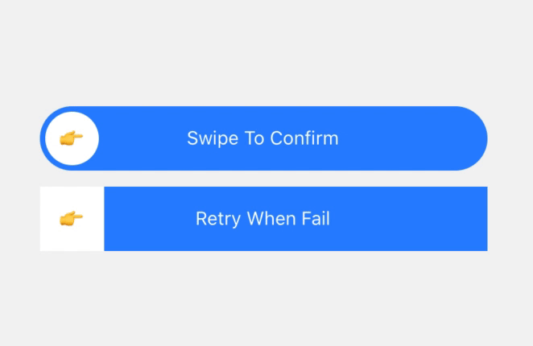

## RnSwipeToConFirm
swipe to confirm component for react-native

### Install
```bash
npm install rn-swipe-to-confirm
```

### Props
| name | type |
| - | - |
| containerStyle | ReactNative.ViewStyle |
| renderSlider | (status: Status) => JSX.Element |
| threshold | number |
| onSwipeStart | () => void |
| onConfirm | <T>() => Promise<T> | void; |
| children | ReactNode |
| onStatusChange | (status: Status) => void; |

### Usage



```js
<SwipeToConfirm
  renderSlider={() => {
    return (
      <View style={styles.slider}>
        <View style={styles.sliderInner}>
          <Text>{status1 === Status.Confirmed ? "👌" : status1 === Status.Verifying ? "⌛" : "👉"}</Text>
        </View>
      </View>
    );
  }}
  onStatusChange={(s: Status) => setStatus1(s)}
  onConfirm={() => {
    return new Promise((resolve, reject) => {
      setTimeout(() => {
        resolve();
      }, 1000);
    });
  }}
>
  <Text style={{color: 'white'}}>{status1 === Status.Confirmed ? 'Confirmed' : 'Swipe To Confirm'}</Text>
</SwipeToConfirm>
<SwipeToConfirm
  containerStyle={{
    borderRadius: 0,
    backgroundColor: status2 === Status.Failed ? 'red' : '#2985FF'
  }}
  renderSlider={(status) => {
    return (
      <View
        style={{
          width: 48,
          height: 48,
          justifyContent: "center",
          alignItems: "center",
          borderRadius: 0,
          backgroundColor: "white",
        }}
      >
        <Text>{status === Status.Confirmed ? "👌" : status === Status.Verifying ? "⌛" : "👉"}</Text>
      </View>
    );
  }}
  onStatusChange={(s: Status) => setStatus2(s)}
  onConfirm={() => {
    return new Promise((resolve, reject) => {
      setTimeout(() => {
        reject();
      }, 1000);
    });
  }}
>
  <Text style={{color: 'white'}}>Retry When Fail</Text>
</SwipeToConfirm>
```

View it on [Expo.io](https://snack.expo.io/@helkyle/aec702)